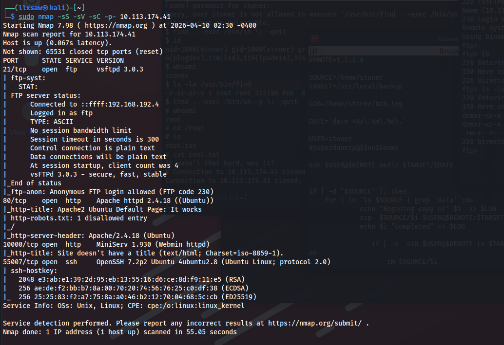
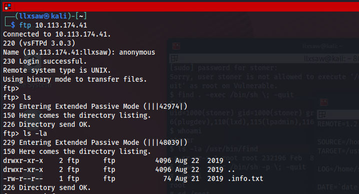
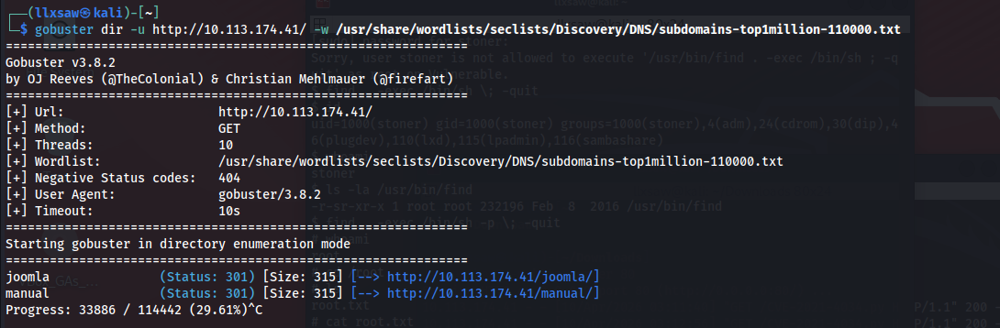
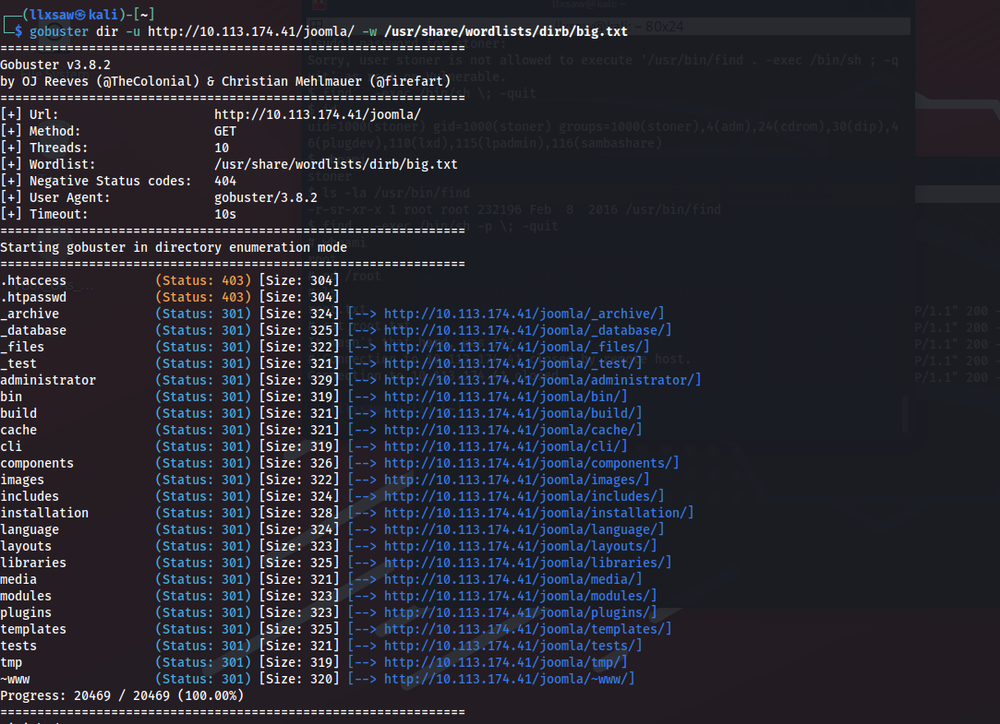
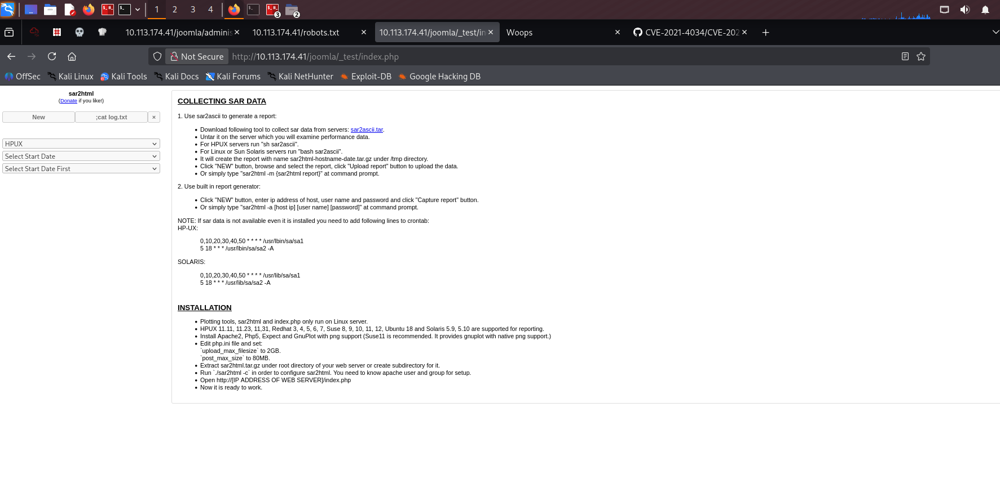
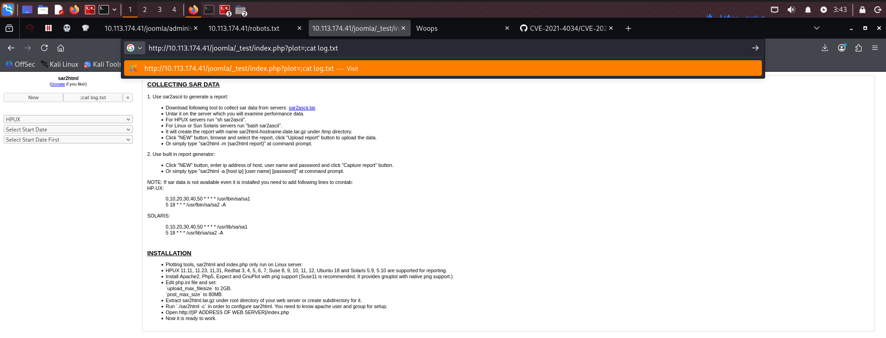
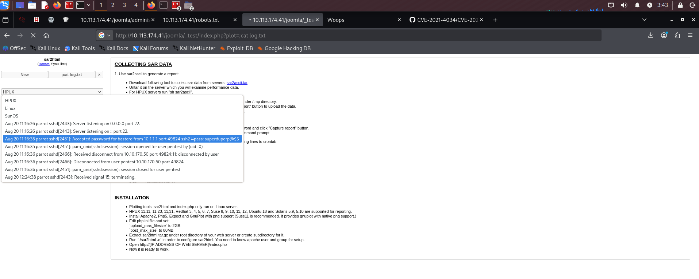
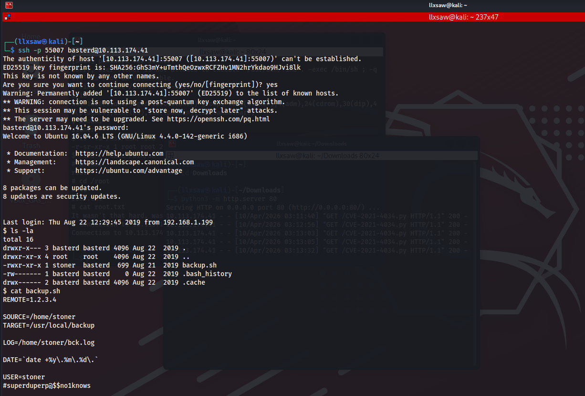
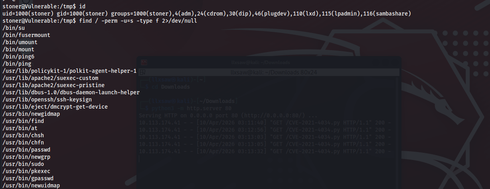
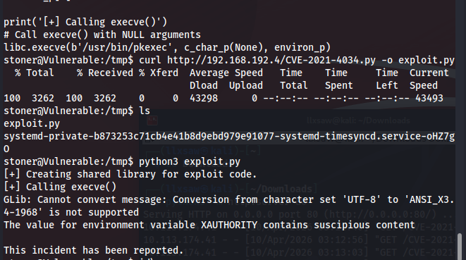

# 🏴‍☠️ Boiler CTF Penetration Testing Write-up

## 🔍 Step 1: Enumeration & Reconnaissance

We start our assessment by running an `Nmap` scan against the Boiler CTF machine to discover open ports and running services [1].



The scan reveals several interesting open ports [1]:
* **21/tcp** - FTP (vsftpd 3.0.3)
* **80/tcp** - HTTP (Apache httpd 2.4.18)
* **10000/tcp** - HTTP (MiniServ 1.930 / Webmin)
* **55007/tcp** - SSH (OpenSSH 7.2p2) running on a non-standard port.

Since anonymous FTP login is allowed, we connect to the FTP server and discover a hidden file named `.info.txt` [2].



Next, we move to the web application on port 80 and use `Gobuster` to brute-force the directories [3]. The scan quickly finds a `/joomla` directory [3].



We run another `Gobuster` scan specifically targeting the `http://<IP>/joomla/` endpoint, which unveils numerous standard Joomla directories along with an interesting `_test` directory [4].



---

## 🕸️ Step 2: Web Application Exploitation

Navigating to `http://<IP>/joomla/_test/index.php`, we are greeted by a web application called **sar2html** [5].



A quick search reveals that `sar2html` is vulnerable to Remote Code Execution (RCE) via the `plot` parameter [6]. We test this vulnerability by injecting a simple command directly into the URL to read a log file: `?plot=;cat log.txt` [6].



Looking at the output in the application's dropdown menu, we hit the jackpot! The `log.txt` file contains plaintext SSH credentials for the user `basterd`: `superduperp@$$` [7].



---

## 🚪 Step 3: Initial Foothold & Lateral Movement

With valid credentials in hand, we connect to Boiler CTF via SSH on the non-standard port **55007** [1, 8]. 



Once logged in as `basterd`, we check our current directory and find a `backup.sh` script [8]. Reading the script's contents reveals the password for another user named `stoner` (`#superduperp@$$no1knows`) [8].

---

## 🛑 Step 4: The Failed Exploit Attempt

We successfully switch to the `stoner` user and begin looking for a Privilege Escalation vector by searching for files with the SUID bit set using `find / -perm -u=s -type f 2>/dev/null` [9].



Among the results, we spot `/usr/bin/pkexec` and `/usr/bin/find` [9]. 

Seeing `pkexec`, I immediately thought about the famous **PwnKit vulnerability (CVE-2021-4034)** [10]. I started a Python HTTP server on my local machine to host my custom Python exploit (`CVE-2021-4034.py`) and used `curl` on the Boiler CTF machine to download it into the `/tmp` directory as `exploit.py` [9, 10].

However, things didn't go as planned. When I executed `python3 exploit.py`, the exploit failed to run [10]. The system had restrictions in place, throwing a `GLib: Cannot convert message` error and complaining that the `XAUTHORITY` environment variable contained suspicious content [10]. The exploit was blocked, and the system returned a "This incident has been reported" message [10].



---

## 👑 Step 5: Root Privilege Escalation

Since the custom Python exploit was blocked by system constraints, I took a step back and reviewed the SUID binaries again. I realized that `/usr/bin/find` also had the SUID bit set, which is a classic and reliable privilege escalation vector [9].

I bypassed the need for complex exploits and simply abused the `find` binary's `-exec` parameter to spawn a privileged shell [11]:

```bash
$ find . -exec /bin/sh -p \; -quit
It worked flawlessly! We get a # prompt and verify our identity with whoami, which returns root
.
Finally, we navigate to /root and read the root.txt flag:
It wasn't that hard, was it?
Boiler CTF completely compromised! 🚀