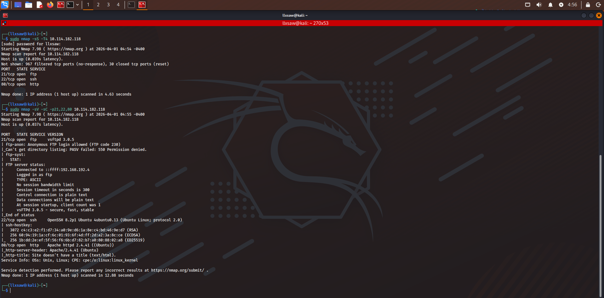
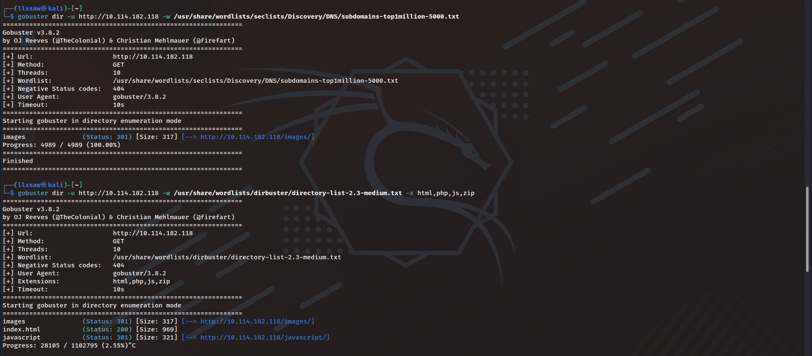
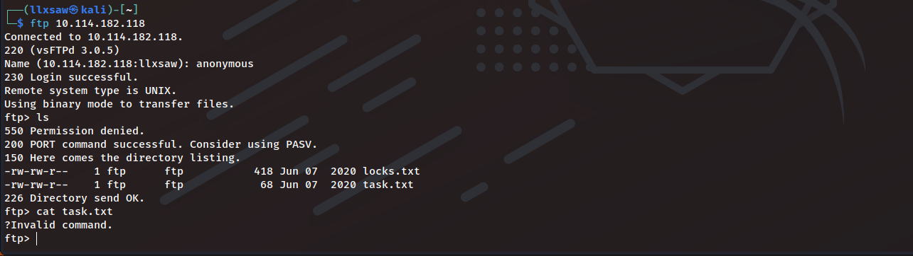
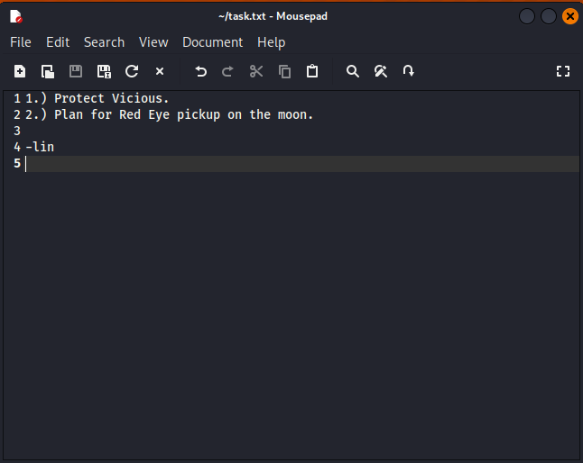
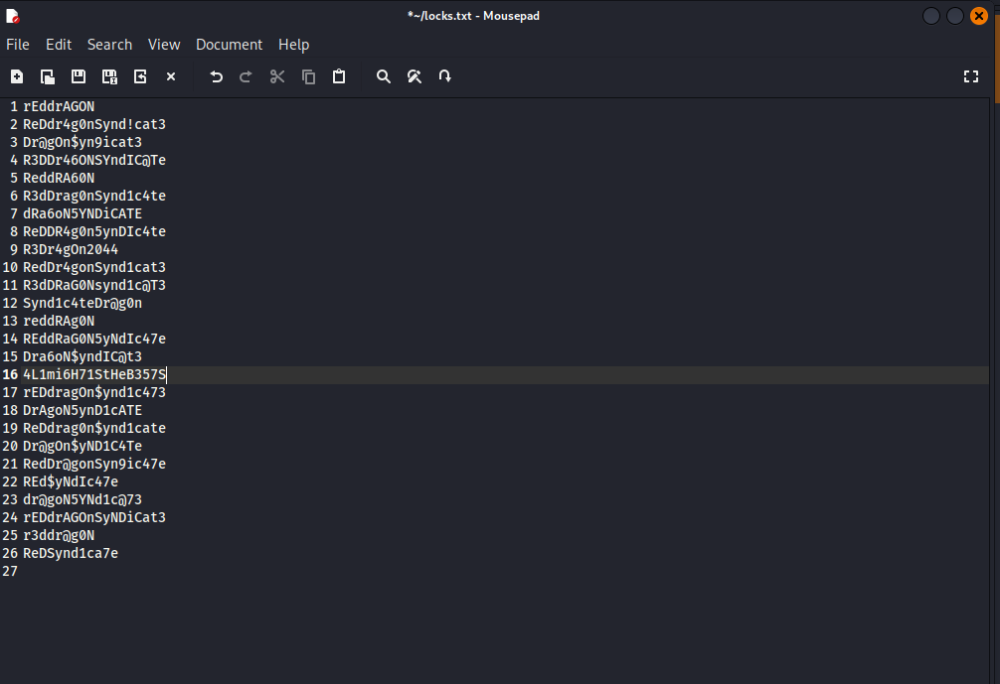
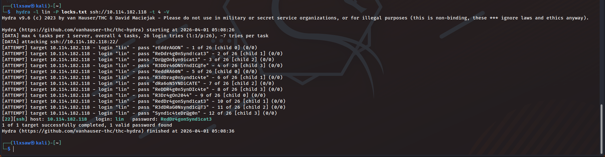
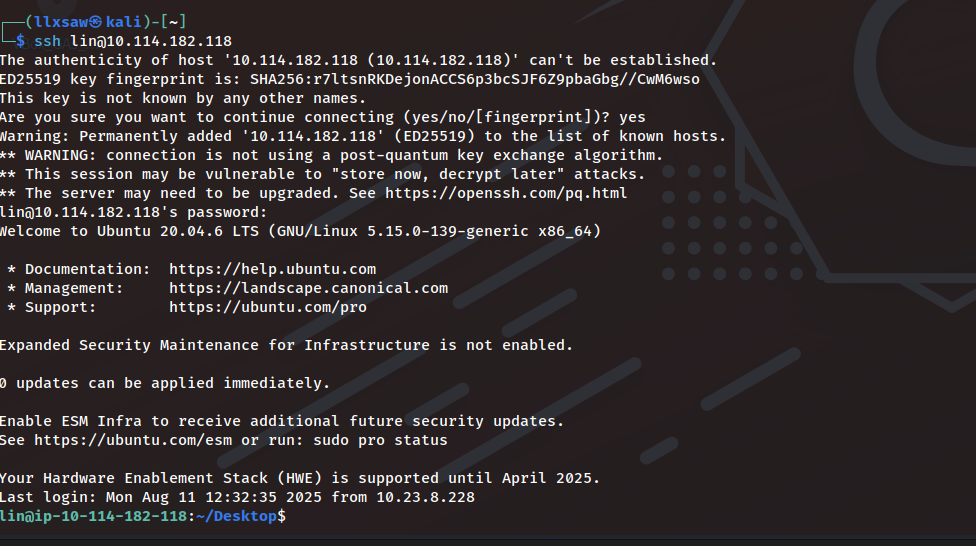
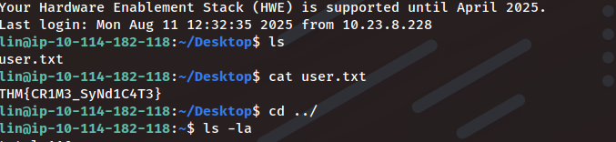
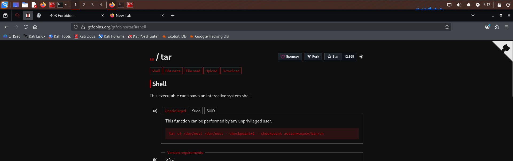
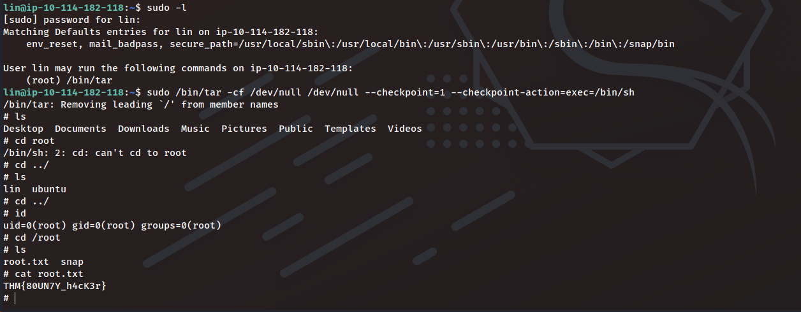

# TryHackMe - Bounty Hunter CTF Writeup

## 1. Reconnaissance
First, I ran an Nmap scan to discover open ports and running services. The scan showed that ports 21 (FTP), 22 (SSH), and 80 (HTTP) were open [4].

I also ran a Gobuster scan to enumerate hidden directories on the web server. It revealed a few standard paths like `/images` and `/javascript`, but nothing critical for the initial foothold [5].

## 2. FTP Enumeration
Since the Nmap scan indicated that anonymous login was allowed on the FTP server, I connected to it using the username `anonymous` [1, 4]. 

Inside the FTP server, I listed the files and found `task.txt` and `locks.txt`. I used the `get` command to download both files to my local machine for further analysis [1]. Reading `task.txt` revealed a message mentioning a potential username: `lin` [6].

Next, I inspected the `locks.txt` file. It contained a list of strings that looked exactly like a custom password wordlist [7].

## 3. Initial Access (SSH)
With a valid username (`lin`) and a wordlist (`locks.txt`), I used Hydra to brute-force the SSH service. Hydra quickly found a valid password: `RedDr4g0nSynd1cat3` [8].

Using these credentials, I successfully logged into the target machine via SSH [9].

After gaining access, I listed the contents of the Desktop directory and read the `user.txt` file to claim the first flag: `THM{CR1M3_SyNd1C4T3}` [2].

## 4. Privilege Escalation
To find a way to escalate my privileges, I checked what commands the user `lin` could run with `sudo` by typing `sudo -l`. The output showed that `lin` was allowed to run `/bin/tar` as root without providing a password [3]. 

I searched for the `tar` binary on GTFOBins and found a payload designed to spawn a shell by abusing the `--checkpoint` feature of tar [10].

I executed the exact command provided by GTFOBins: 
`sudo /bin/tar -cf /dev/null /dev/null --checkpoint=1 --checkpoint-action=exec=/bin/sh`

This successfully spawned a root shell! Finally, I navigated to the `/root` directory and read the `root.txt` file to get the final flag: `THM{80UN7Y_h4cK3r}` [3].

