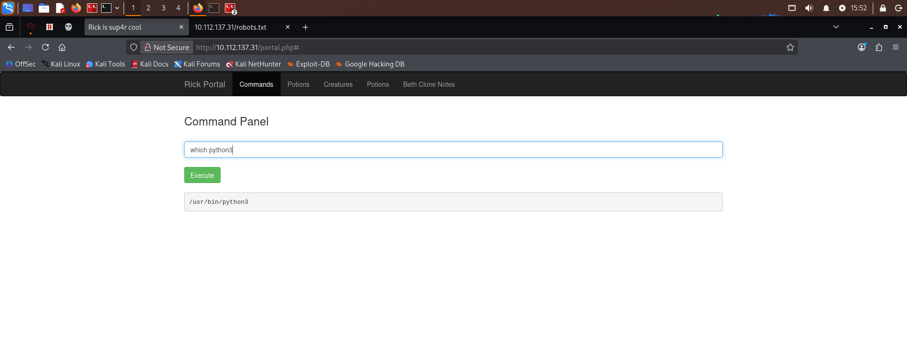
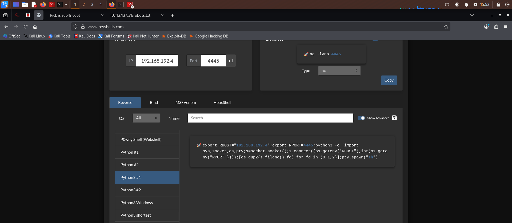
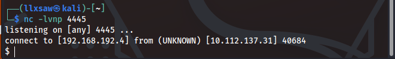
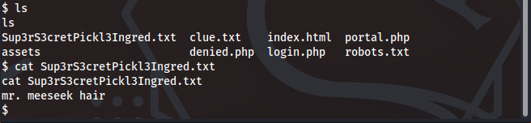
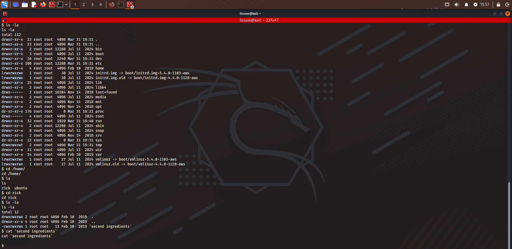
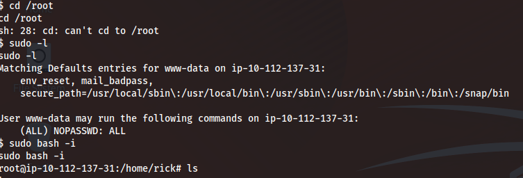
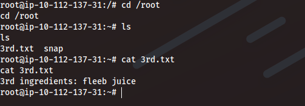


```
** TryHackMe - Pickle Rick CTF Writeup**

## 1. Reconnaissance
First, I ran an Nmap scan to find open ports and running services. The scan revealed that ports 22 (SSH) and 80 (HTTP) were open.


I visited the main website on port 80.


Inspecting the source code of the main web page revealed a hidden comment containing a username: `R1ckRul3s`.


I also checked the `/robots.txt` file and discovered a strange string: `Wubbalubbadubdub`, which looked like a potential password.


To find hidden directories, I ran a Gobuster scan, which revealed several interesting pages, including `/login.php` and `/portal.php`.


## 2. Initial Access
Using the credentials `R1ckRul3s` and `Wubbalubbadubdub`, I successfully logged into the web application and accessed a "Command Panel". I executed the `ls` command to view the current directory contents.


However, trying to read files directly (like using the `cat` command) was blocked by the application.


To bypass this restriction and gain a proper shell, I checked if Python 3 was available by running `which python3`. It returned `/usr/bin/python3`.



I generated a Python 3 reverse shell payload using revshells.com.



After setting up a Netcat listener on my attack machine (`nc -lvnp 4445`), I executed the payload in the Command Panel and successfully caught a reverse shell.



## 3. Finding the Ingredients (Flags)
With a functional shell as the `www-data` user, I was able to read the first flag file, `Sup3rS3cretPickl3Ingred.txt`, which contained the first ingredient: `mr. meeseek hair`.



I then navigated to the `/home/rick` directory, listed its contents, and found the second flag in a file named `second ingredients`. Reading it revealed the text: `1 jerry tear`.



## 4. Privilege Escalation
To elevate my privileges, I checked my sudo permissions by running `sudo -l`. I discovered that the `www-data` user was allowed to run any command with `sudo` without providing a password. I easily escalated to the `root` user by running `sudo bash -i`.



Finally, I navigated to the `/root` directory, where I found the file `3rd.txt`. Reading this file gave me the final ingredient: `3rd ingredients: fleeb juice`.



```


