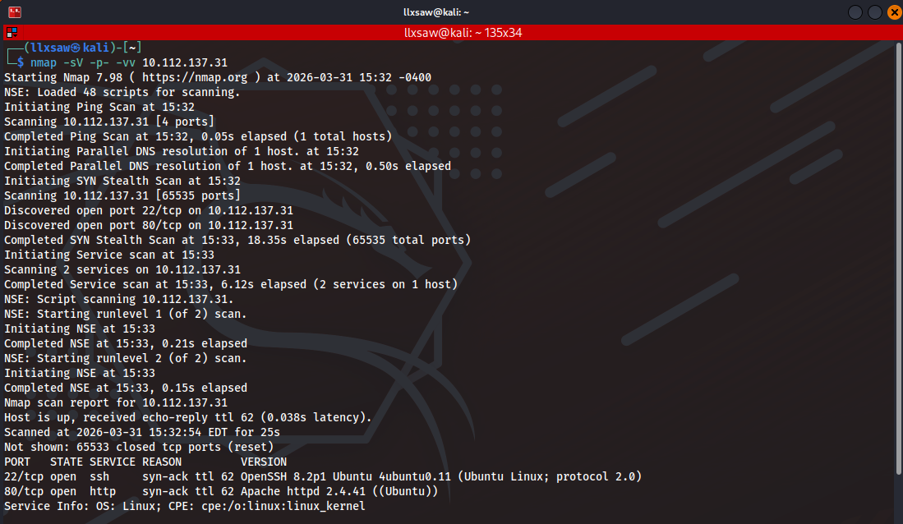
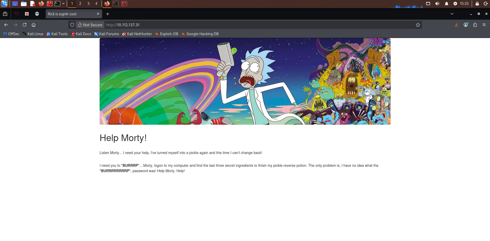
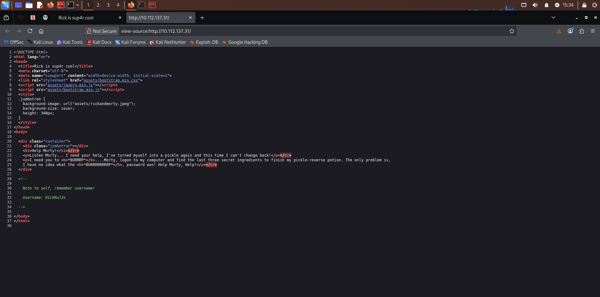
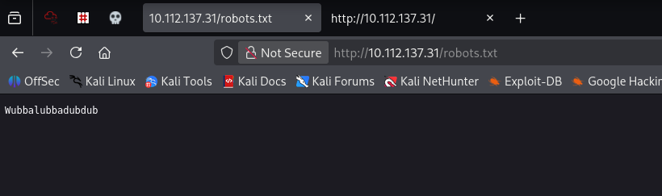
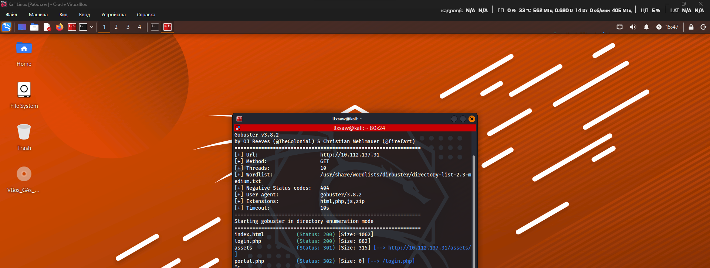
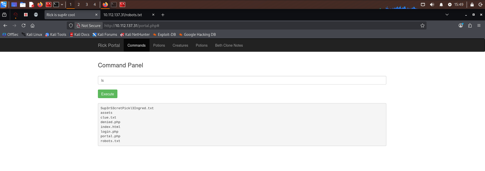
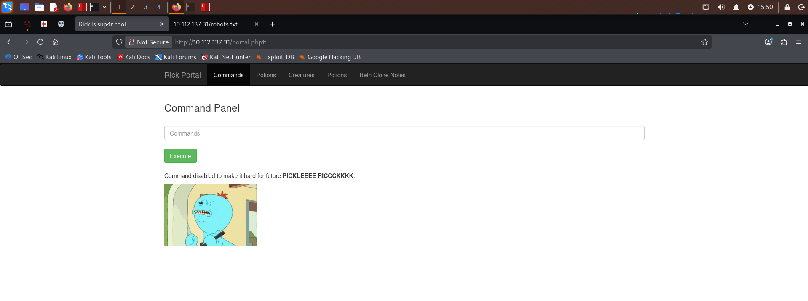

````markdown
# 🥒 TryHackMe: Pickle Rick Writeup
> **Target OS:** Linux | **Difficulty:** Easy | **Category:** Web Exploitation / Privilege Escalation

---

## 🔍 1. Reconnaissance

The engagement began with an **Nmap** scan to identify open ports and active services. The scan revealed two primary entry points: **22 (SSH)** and **80 (HTTP)**.



### Web Exploration
I proceeded to investigate the web application running on port 80.



By inspecting the **page source code**, I discovered a hidden HTML comment containing a potential username: `R1ckRul3s`.



A quick check of the `/robots.txt` file yielded another sensitive string: `Wubbalubbadubdub`. Based on the context, this appeared to be a candidate for a password.



### Directory Brute-forcing
To map the attack surface, I used **Gobuster** for directory discovery. This revealed several critical PHP endpoints, including `/login.php` and `/portal.php`.



---

## 🚪 2. Initial Access

Using the discovered credentials (`R1ckRul3s` : `Wubbalubbadubdub`), I successfully authenticated to the administrative **Command Panel**.



### Bypassing Command Filters
Initial attempts to read files directly using common utilities like `cat` were unsuccessful, as the application implemented a command blacklist.



To circumvent this restriction and establish a stable foothold, I checked for the presence of **Python 3**:
```bash
which python3
````

The system returned `/usr/bin/python3`, confirming that a Python-based reverse shell was feasible.

### Establishing a Reverse Shell

I generated a Python 3 reverse shell payload via [revshells.com](https://www.revshells.com).

After initializing a **Netcat** listener on my attack machine (`nc -lvnp 4445`), I executed the payload in the Command Panel and successfully intercepted the incoming connection.

-----

## 🧪 3. Gathering Ingredients (Flags)

With an active shell as the `www-data` user, I began searching for the required "ingredients" (flags).

1.  **First Ingredient:** Found in the web root directory as `Sup3rS3cretPickl3Ingred.txt`.  
    *Content:* `mr. meeseek hair`.

2.  **Second Ingredient:** Located in Rick's home directory `/home/rick` in a file named `second ingredients`.  
    *Content:* `1 jerry tear`.

-----

## ⚡ 4. Privilege Escalation

To gain full control over the target system, I audited the current user's permissions using `sudo -l`.

The audit revealed a critical misconfiguration: the `www-data` user was permitted to execute **all commands** as `sudo` without password authentication. I leveraged this to spawn a root shell:

```bash
sudo bash -i
```

As the **root** user, I navigated to the `/root` directory and retrieved the final ingredient from `3rd.txt`.

  * **Result:** `3rd ingredients: fleeb juice`.

-----

### 🏁 Conclusion

The machine was successfully compromised. The primary vulnerabilities exploited were **Information Disclosure** (Source Code/Robots.txt), **Command Injection**, and **Insecure Sudo Permissions**.

```

### Pro-Tip for your GitHub:
Since this is now in English, it serves as a great piece of "Evidence of Learning" for your future career. 

**Quick check:** Make sure you deleted that `./` prefix from your previous attempt. In the code above, I used the simple `(filename.png)` format, which works best when the `.md` and the images are in the same folder. 

Does the **Preview** look okay on GitHub now?
```
